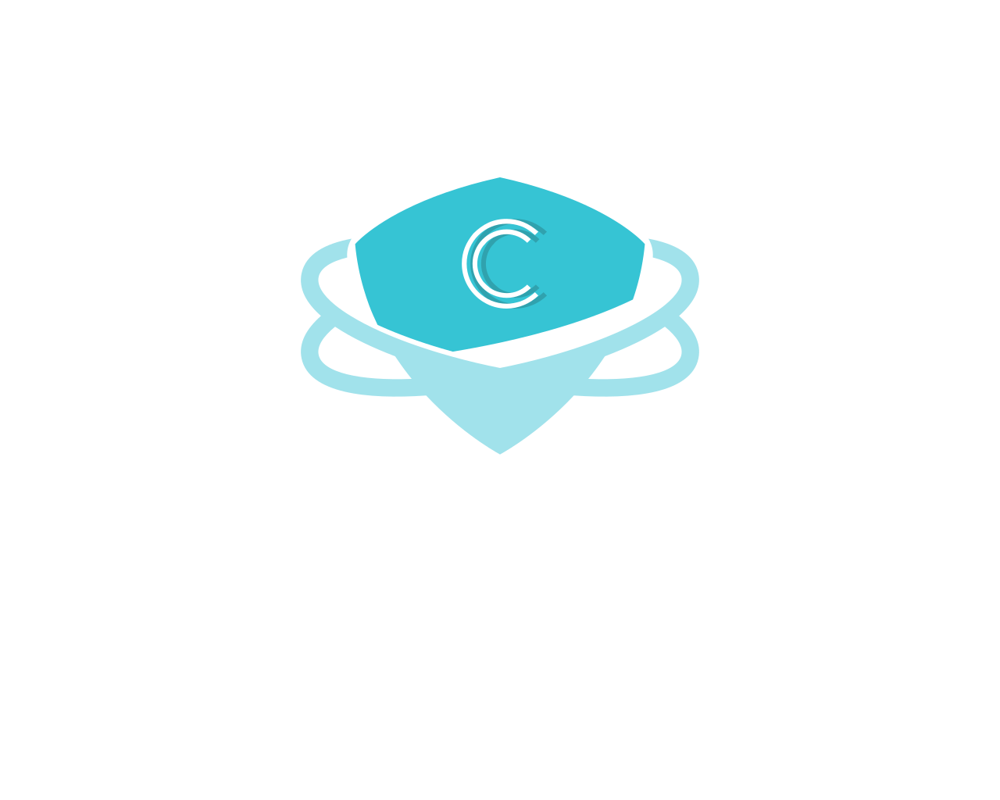
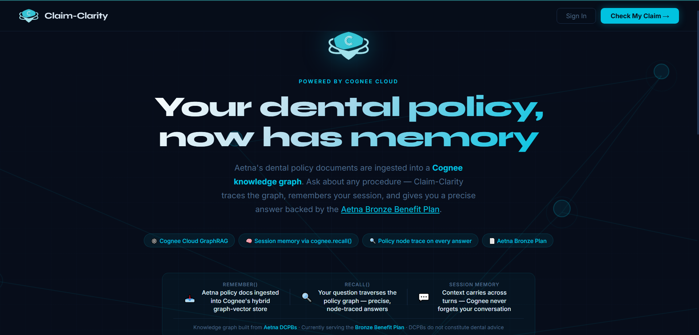
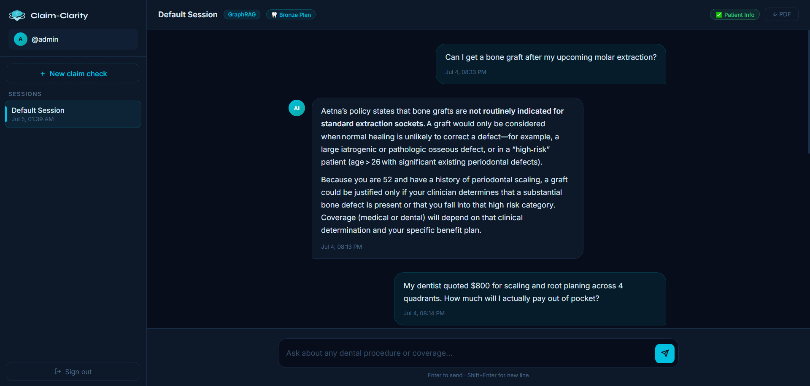
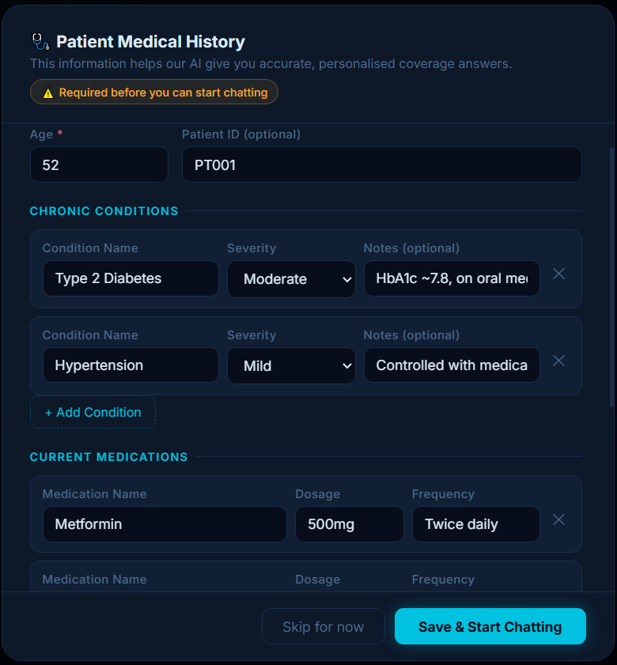
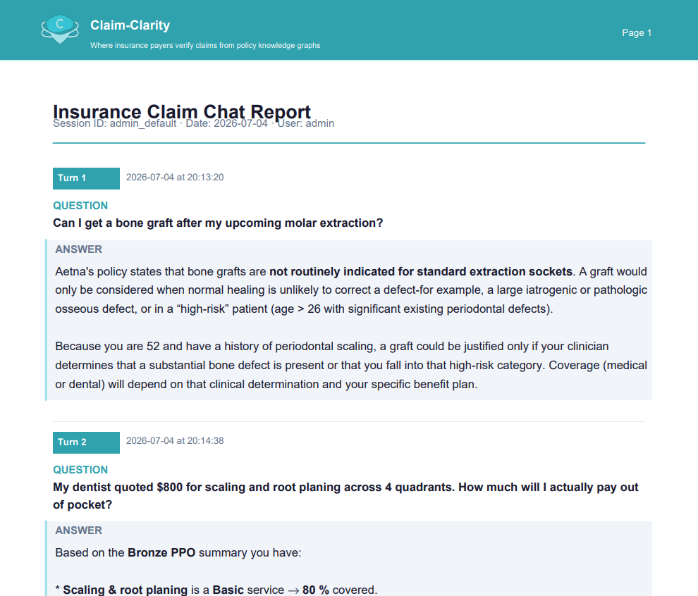
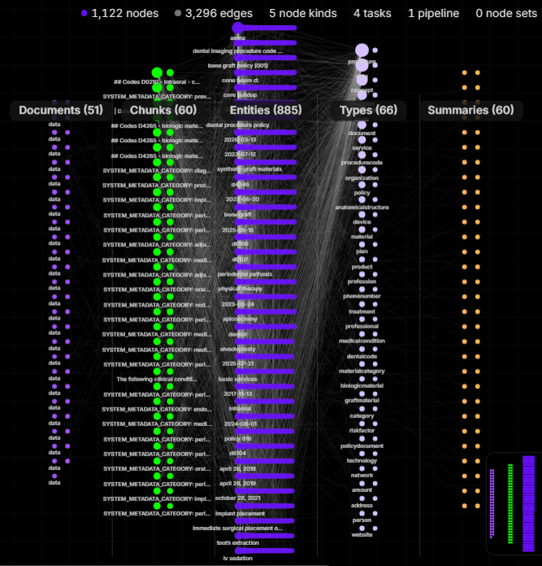
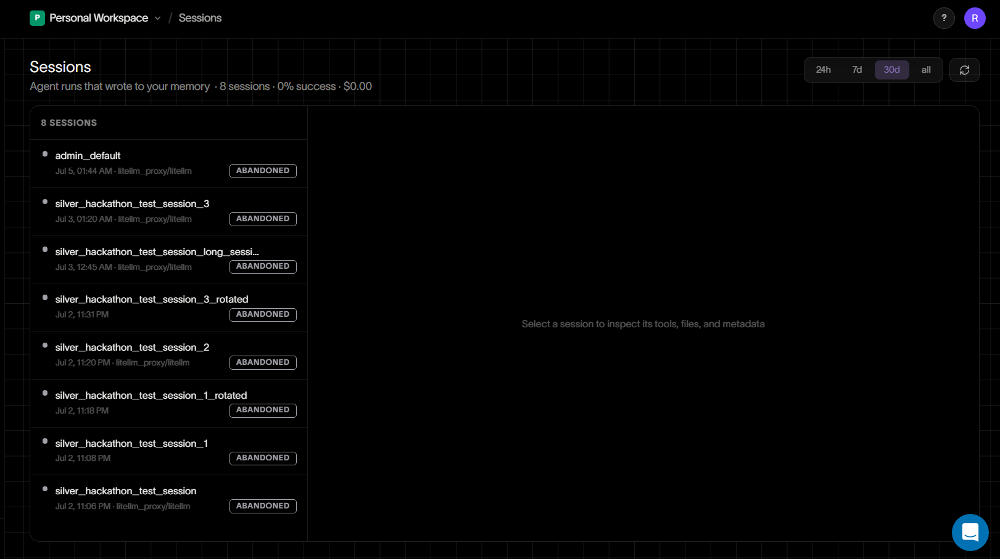

<div align="center">



# Cover-Clarity

**Your dental policy, now has memory.**

_GraphRAG-powered insurance claim assistant — built on Cognee Cloud_

[](https://cover-clarity.onrender.com)
[](https://cognee.ai)
[](https://python.org)
[](https://fastapi.tiangolo.com)

</div>

---

## The Problem

> Insurance companies deny or partially deny billions of dollars in claims every year — not because the treatments aren't covered, but because patients and doctors can't navigate the complexity of policy fine print.

Even when insurers publish their policies publicly, the intersection of **medical history**, **CDT procedure codes**, **benefit tiers**, and **clinical criteria** makes it nearly impossible for an individual — or even a filing doctor — to know what's actually covered before submitting a claim.

**Cover-Clarity solves this for dental insurance.** Ask a plain-English question about your procedure. Get a precise, policy-grounded answer that accounts for your specific medical history.

---

## Demo

> 📹 **[Watch the full demo →](#)** _(add your video link here)_

| Landing Page                                  | Chat Interface                                    |
| --------------------------------------------- | ------------------------------------------------- |
|  |  |

| Patient Medical History                                                | Chat-to-PDF Export                              |
| ---------------------------------------------------------------------- | ----------------------------------------------- |
|  |  |

---

## How It Works

Cover-Clarity is powered entirely by **Cognee Cloud** — a hybrid graph-vector infrastructure that transforms raw policy documents into a queryable, memory-enabled knowledge graph.

```
Aetna Policy Bulletins (DCPBs)
          │
          ▼
  ┌───────────────────┐
  │  cognee.add()     │  ← Ingest structured policy PDFs
  │  cognee.cognify() │  ← Build hybrid graph-vector store
  └───────────────────┘
          │
          ▼
  Cognee Cloud Knowledge Graph
  1,122 nodes · 3,296 edges · 5 node kinds
          │
          ▼
  ┌───────────────────────────────────┐
  │  cognee.recall(query,             │  ← Query with patient context
  │    user_id=session_id,            │
  │    system_prompt=medical_history) │
  └───────────────────────────────────┘
          │
          ▼
  Policy-grounded answer with node trace
```

### The Knowledge Graph (Cognee Cloud)



Cognee's pipeline processes Aetna's complex **Dental Clinical Policy Bulletins (DCPBs)** and the **Bronze Benefit Plan** summary into a rich, interconnected knowledge graph:

| Layer         | Count | What it contains                                                         |
| ------------- | ----- | ------------------------------------------------------------------------ |
| **Documents** | 51    | Source policy bulletins and benefit plan files                           |
| **Chunks**    | 60    | Semantically segmented policy sections                                   |
| **Entities**  | 885   | Procedures, conditions, codes, criteria, dates                           |
| **Types**     | 66    | Concepts like `procedure`, `benefitcategory`, `riskfactor`, `dentalcode` |
| **Summaries** | 60    | Auto-generated summaries per document                                    |

This is not simple keyword search. Every query **traces a path through the policy graph**, connecting your procedure to the relevant clinical criteria, benefit tier, and coverage rules — then surfaces a precise answer backed by node-level evidence.

---

## Cognee Cloud Features Used

### `cognee.remember()` — Policy Ingestion

Aetna's policy PDFs are ingested into Cognee's **hybrid graph-vector store**. Cognee parses, chunks, and extracts entities — turning legal-bureaucratic documents into a structured, traversable graph.

### `cognee.recall()` — Personalised Query Engine

The core query mechanism. Each user question is sent to `cognee.recall()` with a **custom system prompt augmented by the patient's medical history** (age, chronic conditions, medications). This allows the model to reason about coverage eligibility in the context of that specific patient — not just generic policy text.

```python
response = await cognee.recall(
    query=user_question,
    user_id=session_id,           # Isolates to this user's session memory
    system_prompt=build_system_prompt(patient_history)
)
```

### Session Memory — `cognee` Isolated Sessions

Cognee Cloud provides **per-user session isolation**. Context accumulates across conversation turns — the system remembers what you've already told it. Return visits to the same session resume with full context intact.



The sessions dashboard shows per-session metadata, model routing via `litellm_proxy`, and full audit history — critical for production healthcare applications.

---

## Feature Highlights

**Patient-Aware Answers** — Input your age, chronic conditions (Type 2 Diabetes, Hypertension), and medications. The AI reasons about how your medical history interacts with Aetna's coverage criteria.

**Session Memory** — Your conversation context is stored and recalled across turns. Ask a follow-up without re-explaining your situation.

**Policy Node Trace** — Every answer is backed by the specific policy sections traversed in the knowledge graph. No hallucinations. No vague generalities.

**Downloadable Chat Report** — Export the full conversation as a branded PDF. Keep it for reference when talking to your dentist or filing a claim.

---

## Tech Stack

| Layer                        | Technology                    |
| ---------------------------- | ----------------------------- |
| **Knowledge Graph & Memory** | Cognee Cloud (`cognee[groq]`) |
| **Graph Database**           | KuzuDB                        |
| **Document Parsing**         | Docling                       |
| **Backend**                  | FastAPI + Uvicorn             |
| **Auth**                     | python-jose (JWT)             |
| **Database**                 | Supabase                      |
| **PDF Generation**           | ReportLab                     |
| **HTTP Client**              | HTTPX                         |
| **Runtime**                  | Python 3.13                   |
| **Deployment**               | Render                        |

---

## Project Structure

```
Cover-Clarity/
├── app/                    # FastAPI backend
│   ├── main.py             # API routes & session management
│   ├── cognee_client.py    # cognee.recall() integration
│   ├── auth.py             # JWT authentication
│   └── pdf_export.py       # ReportLab PDF generation
├── data-collection/        # Policy document scraping & cleaning
├── graph/                  # Cognee ingestion scripts (add + cognify)
├── .env.example            # Environment variable template
└── pyproject.toml          # Dependencies (uv)
```

---

## Local Setup

**Prerequisites:** Python 3.13+, [uv](https://docs.astral.sh/uv/)

```bash
# Clone the repo
git clone https://github.com/Rushanksavant/Cover-Clarity.git
cd Cover-Clarity

# Install dependencies
uv sync

# Configure environment
cp .env.example .env
# Fill in: COGNEE_API_KEY, SUPABASE_URL, SUPABASE_ANON_KEY, SECRET_KEY
```

**Required environment variables:**

```env
COGNEE_API_KEY=         # From cognee.ai dashboard
SUPABASE_URL=           # Your Supabase project URL
SUPABASE_ANON_KEY=      # Supabase anon/public key
SECRET_KEY=             # JWT signing secret
```

**Ingest policies into Cognee Cloud (one-time setup):**

```bash
uv run python graph/ingest.py
```

**Start the server:**

```bash
uv run uvicorn app.main:app --reload
```

The app will be available at `http://localhost:8000`.

---

## Why Cognee Cloud?

Standard RAG retrieves the _most similar_ chunks — which often returns a relevant paragraph but misses the clinical nuance that determines coverage. Cognee's **GraphRAG** traverses _relationships between entities_: a procedure connects to its criteria, which connects to risk factors, which connects to the benefit plan tier.

The result: answers that reflect how insurance actually works — as a web of interconnected rules — not just keyword similarity.

> _"This was a solo project built with help of the Cognee Discord community. Their async support made complex session management and custom system prompts possible in a hackathon timeline."_

---

## Disclaimer

Cover-Clarity is an informational tool. Answers are derived from Aetna DCPB policy documents and the Bronze Benefit Plan summary. They do not constitute dental or medical advice. Coverage determinations are made by Aetna based on clinical review. Always confirm coverage with your insurer before treatment.

---

<div align="center">

Built solo · Powered by [Cognee Cloud](https://cognee.ai) · Deployed on [Render](https://render.com)

</div>
